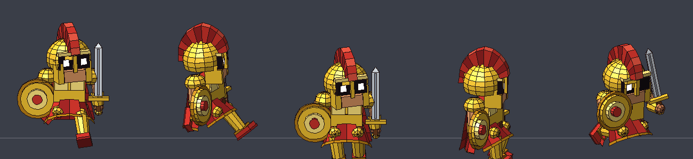
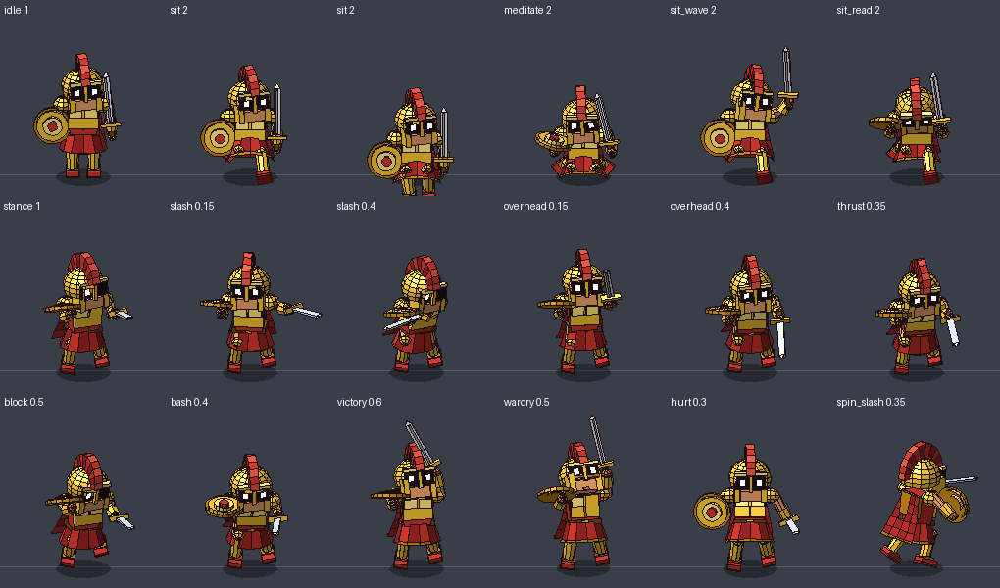
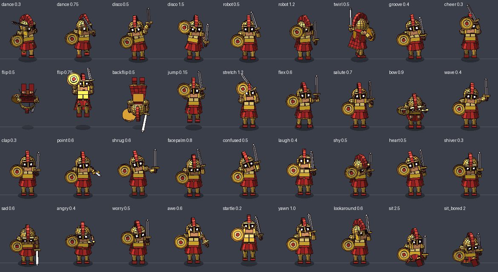

# ARES Companion

ARES is an AI-powered 3D desktop assistant for Windows that lives on your screen. 

## Key Features

* **Desktop Presence:** ARES roams your screen, walks on the taskbar, and can perch on the top edges of open windows. He is rendered in real 3D using a custom software renderer without relying on external image files.
* **Voice Control & AI Vision:** Summon ARES using a global hotkey (default: `) to dictate text, draft emails, or ask questions. He can also analyze your screen to summarize web pages, translate text, review code, or find bugs.
* **Productivity Tools:** Includes built-in commands for setting timers, running Pomodoro focus sessions, taking quick notes, and monitoring system hardware like CPU, RAM, and battery levels.
* **Daily Habits:** Delivers a morning briefing covering your calendar and local weather, alongside periodic nudges to drink water, stretch, or rest your eyes during long work sessions.
* **Interactivity & Antics:** You can pet, poke, or drag him across the screen using your mouse. When idle, he entertains himself with a large library of animations, including sword practice, dancing, backflips, and meditating.

## Installation & Setup

1. Install the required GUI and system dependencies by running `pip install PySide6 psutil`.
2. Configure your environment variables and API keys (e.g., Groq, Tavily, Sarvam) in the `.env` file.
3. Double-click `Ares.pyw` to launch the companion silently in the background without opening a terminal window.

## Usage

* **Commands:** Press the ` (backtick) key to wake ARES up and speak your command. 
* **Interaction:** Left-click and hold to drag him around your workspace, or stroke the mouse back and forth over him to pet him. 
* **Gaming Mode:** ARES monitors active windows and will automatically hide himself when a fullscreen game or application is in focus.